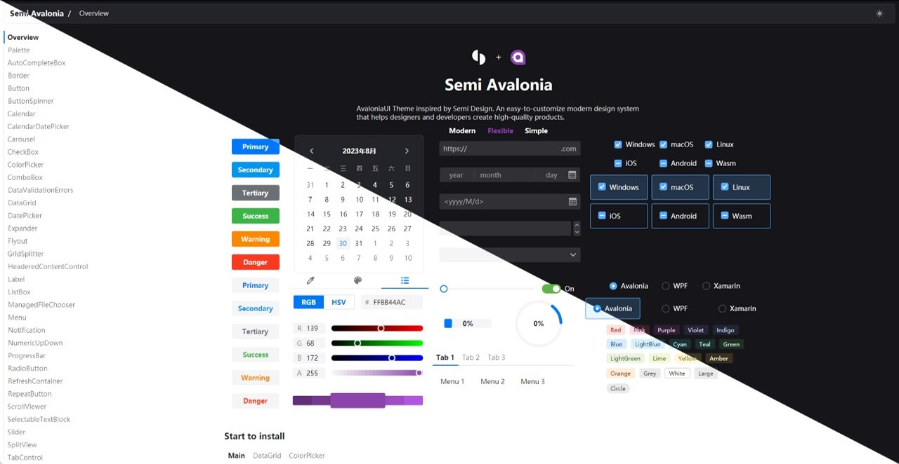

# Semi Avalonia

[](https://www.nuget.org/packages/Semi.Avalonia/)
[](https://www.nuget.org/packages/Semi.Avalonia/)
[](https://gitcode.com/IRIHI_Technology/Semi.Avalonia)

[中文](./README_CN.md)

Avalonia Theme inspired by Semi Design

Semi.Avalonia can be previewed in the browser [here](https://irihitech.github.io/Semi.Avalonia/)

If you are looking for more detailed documentation, Please visit [Semi Documentation](https://docs.irihi.tech/semi/)

If you are looking for more customized controls, Please try [Ursa](https://github.com/irihitech/Ursa.Avalonia)



## How to Use

### Installation

```bash
dotnet add package Semi.Avalonia
```

Include Semi Design Styles in application:

```xaml
<Application
    ...
    xmlns:semi="https://irihi.tech/semi">
    <Application.Styles>
        <semi:SemiTheme Locale="zh-CN" />
    </Application.Styles>
</Application>
```

That's all.

ColorPicker, DataGrid and TreeDataGrid are distributed in separated packages. Please install if you need.

```bash
dotnet add package Semi.Avalonia.ColorPicker
dotnet add package Semi.Avalonia.DataGrid
dotnet add package Semi.Avalonia.TreeDataGrid
```

```xaml
<Application.Styles>
    <StyleInclude Source="avares://Semi.Avalonia.ColorPicker/Index.axaml" />
    <StyleInclude Source="avares://Semi.Avalonia.DataGrid/Index.axaml" />
    <StyleInclude Source="avares://Semi.Avalonia.TreeDataGrid/Index.axaml" />
</Application.Styles>
```

## Demo

You can always download demo executable to play around with Semi Avalonia Themes.
<https://github.com/irihitech/Semi.Avalonia/releases>

## Support

We offer limited free community support for Semi Avalonia and Ursa. If you have any question or suggestion, feel free to raise issues and discussions via GitHub, and you are welcomed to join our group via FeiShu(Lark)

 

## Version compatibility

| Semi Design Version | Avalonia Version |
|:--------------------|:-----------------|
| 11.2.1              | >=11.2.1         |
| 11.2.0              | 11.2.0           |
| 11.1.0              | >=11.1.0         |
| 11.0.7              | >=11.0.7         |
| 11.0.1              | <=11.0.6         |

## Credits

[Semi Design](https://semi.design/)

[Avalonia](https://github.com/AvaloniaUI/Avalonia)

[FluentAvalonia](https://github.com/amwx/FluentAvalonia)

[Material Design Icons](https://pictogrammers.com/library/mdi/)

[CommunityToolKit](https://github.com/CommunityToolkit/dotnet)

