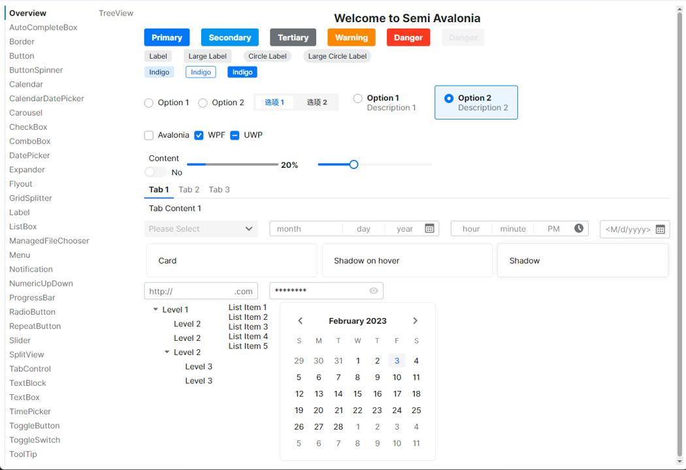
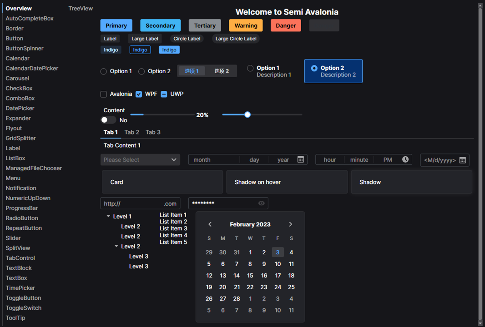

# Semi.Avalonia

[](https://www.nuget.org/packages/Semi.Avalonia/)
[](https://www.nuget.org/packages/Semi.Avalonia/)

Avalonia Theme inspired by Semi Design

> Semi.Avalonia is still in very early stage. Please don't use in production.

# How to Use

## Installation
```bash
dotnet add package Semi.Avalonia --version 0.1.0-preview5
```
Include Semi Design Styles in application:

```xaml
<Application.Styles>
    <StyleInclude Source="avares://Semi.Avalonia/Themes/DarkTheme.axaml" />
</Application.Styles>
```

That's all. 

## Version compatibility

|Semi Design Version| Avalonia Version|
|:---|:---|
|0.1.0-preview3|11.0-preview4|
|0.1.0-preview5|11.0-preview5|

## TODO
* DataValidationErrors
* FocusAdorner
* DataGrid
* ColorPicker

## Screenshot

Light Mode


Dark Mode
